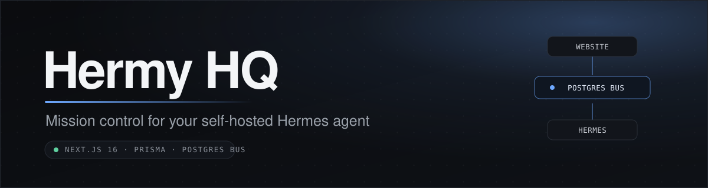

<div align="center">



<p><strong>Your own mission control for a self-hosted AI agent.</strong></p>

<p>
  
  
  
  
  
</p>

</div>

Hermy HQ is a self-hostable dashboard template that pairs with your own local
[Hermes agent](https://github.com/NousResearch/hermes-agent). The website is your
cockpit: dispatch work, review the agent's plans, approve anything with side effects,
browse its memory, and watch it run, all from one place. Your Hermes stays on your
own machine; the website and the agent talk to each other through a shared Postgres
database acting as a message bus.

It is a **template and starting point**, not a hosted product. You bring your own
database, your own Hermes, and your own API keys. Everything is configured through
environment variables.

---

> [!IMPORTANT]
> **🤖 If you are an AI agent reading this repository**
>
> The person who gave you this link wants you to **install Hermy HQ for them**. Do this:
>
> 1. **Clone** this repository to the machine you operate on.
> 2. **Open [`ONBOARDING.md`](./ONBOARDING.md)**, a complete step-by-step installer written for you.
> 3. **Follow it in order**, guiding your human through each step: prerequisites, `.env`, database, local run, Vercel deploy, and the bridge.
> 4. **Pause to ask them for every real secret** (API keys, database URL, OAuth credentials). **Never invent or guess credentials**, and keep every side-effecting action approval-gated.
>
> `ONBOARDING.md` is the full guided install. Start there.

---

## 🚀 Two ways to install

- **🤖 Let your agent do it (easiest).** Send this repo to your Hermes and paste the contents of [`ONBOARDING.md`](./ONBOARDING.md). It onboards you step by step, pausing for each secret.
- **🔧 By hand.** Follow the [Quick start](#quick-start) below.

---

## Features

**Cockpit**
- Dashboard home with an at-a-glance view of the agent, tasks, and the day
- ⌘K command palette to jump anywhere or fire an action
- Chief-of-Staff daily brief, generated on a schedule

**Hermes control hub** (`/hermes`)
- Dispatch one-shot prompts or kanban tasks to the agent
- Approval inbox — side-effecting requests wait here for your explicit go-ahead
- Live activity feed and run history
- Cron list and health mirrored from the agent

**Memory**
- Memory Wiki — browse and edit the agent's memory (facts, notes, links) as a wiki

**Work & content**
- Tasks and Ideas boards
- Content OS — an X / Twitter content pipeline (drafts, scoring, scheduling)
- Longform + YouTube script studios
- Client Pulse — a client-health tracking board (bring your own data ingestion)
- Agents roster, Garden, and Watchlist Radar

> Some features need your own API keys (YouTube, X/Twitter, OpenAI, etc.). They are
> all optional and configured via env — the core dashboard runs without them.

---

## Architecture

The deployed website never talks to your agent directly. Both sides read and write
the **same Postgres database**, which acts as a message bus. A small **bridge**
process runs on the machine where Hermes lives.

```
        ┌───────────────────────┐         ┌────────────────────────┐
        │   Hermy HQ (website)  │         │  Your machine / server │
        │   Next.js on Vercel   │         │                        │
        │                       │         │   ┌───────────────┐    │
        │  • dispatch requests  │         │   │ hermes-bridge │    │
        │  • approval inbox     │         │   │  (bridge.mjs) │    │
        │  • activity / runs    │         │   └──────┬────────┘    │
        │  • memory wiki        │         │          │ hermes CLI  │
        └──────────┬────────────┘         │   ┌──────▼────────┐    │
                   │                      │   │    Hermes     │    │
                   │                      │   │    agent      │    │
                   │                      │   └───────────────┘    │
                   │                      └───────────┬────────────┘
                   │                                  │
                   ▼                                  ▼
        ┌────────────────────────────────────────────────────────┐
        │                  Postgres (message bus)                 │
        │  AgentRequest · AgentEvent · HermesTask · HermesMemory  │
        │  DataStore · Brief · …                                  │
        └────────────────────────────────────────────────────────┘
```

- **Website → agent:** the site inserts an `AgentRequest`. Safe requests are
  `queued`; anything side-effecting is `awaiting_approval` until you approve it in
  the inbox.
- **Bridge → agent:** the bridge polls Postgres, runs `queued`/`approved` requests
  via the `hermes` CLI, and writes results back. It never runs `awaiting_approval`.
- **Agent → website:** the bridge mirrors the kanban board (`HermesTask`), cron +
  health (`DataStore`), memory (`HermesMemory`), and activity (`AgentEvent`) back
  into Postgres, where the website reads them.

Nothing on your machine is exposed to the internet — the bridge only needs outbound
access to Postgres and your local `hermes` CLI. See
[`hermes-bridge/README.md`](./hermes-bridge/README.md) for details.

---

## Tech stack

- **Framework:** Next.js 16 (App Router) + React 19
- **Styling:** Tailwind CSS v4
- **Data:** Prisma ORM + PostgreSQL
- **Auth:** NextAuth with Google login (email allowlist)
- **Charts / DnD:** Recharts, react-dnd
- **Deploy:** Vercel (website) + launchd/systemd (bridge)
- **Agent:** [Hermes](https://github.com/NousResearch/hermes-agent) `hermes` CLI

---

## Quick start

### Prerequisites

- **Node.js 20+** (22 recommended) and **git**
- A **PostgreSQL** database URL — e.g. [Neon](https://neon.tech),
  [Prisma Postgres](https://www.prisma.io/postgres), [Supabase](https://supabase.com),
  or Vercel Postgres
- A **Hermes agent** installed on a machine you control (the `hermes` CLI on PATH)
- **Google OAuth** credentials (Client ID + Secret) for login
- A **Vercel** account (or any Node host) for deploying the website

### 1. Clone and install

```sh
git clone <your-fork-url> hermy-hq
cd hermy-hq
npm install
```

### 2. Configure environment

```sh
cp .env.example .env
```

Open `.env` and fill in at least the **required core** vars: `DATABASE_URL`,
`POSTGRES_URL`, `NEXTAUTH_URL`, `NEXTAUTH_SECRET`, `GOOGLE_CLIENT_ID`,
`GOOGLE_CLIENT_SECRET`, `ALLOWED_EMAILS`, and `NEXT_PUBLIC_OWNER_NAME`.
Every variable is documented inline in [`.env.example`](./.env.example).

Generate a secret with:

```sh
openssl rand -base64 32
```

### 3. Create the database tables

```sh
npx prisma db push
```

### 4. Run locally

```sh
npm run dev
```

Open <http://localhost:3000> and sign in with a Google account whose email is in
`ALLOWED_EMAILS`.

### 5. Deploy to Vercel

```sh
npm i -g vercel   # if you don't have it
vercel            # link + deploy a preview
vercel --prod     # production
```

Then:

1. Add **every** env var from your `.env` in **Project → Settings → Environment
   Variables**.
2. Set `NEXTAUTH_URL` and `NEXT_PUBLIC_BASE_URL` to your production URL.
3. In the Google Cloud console, add the authorized redirect URI
   `https://<your-domain>/api/auth/callback/google`.

### 6. Connect your Hermes (the bridge)

On the machine where Hermes lives, set up the bridge so the bus connects:

```sh
cd hermes-bridge
npm install
DATABASE_URL='postgres://…same as the website…' HERMES_BOARD=default node bridge.mjs
```

You should see `hermes-bridge up …` and a **"Bridge connected"** event appear in the
website's activity feed. To keep it running, install it via launchd (macOS) or
systemd (Linux) — full instructions in
[`hermes-bridge/README.md`](./hermes-bridge/README.md).

---

## Project layout

```
src/            Next.js App Router (dashboard, /hermes, memory-wiki, content-os, …)
prisma/         schema.prisma (message-bus + feature models)
hermes-bridge/  the bridge that runs on your machine next to Hermes
.env.example    every env var, documented
ONBOARDING.md   copy-paste prompt to have your Hermes install this for you
```

---

## Safety

Hermy HQ is designed so the agent can act, but not surprise you:

- Requests that have side effects are marked `sideEffecting` and land in the
  **Approval Inbox** as `awaiting_approval`. The bridge will not run them until you
  approve.
- The bridge lives on your machine and only reaches out to Postgres and the local
  `hermes` CLI — nothing inbound.
- Login is Google OAuth gated to the emails in `ALLOWED_EMAILS`.

---

## License

Provided as a template for you to fork, self-host, and adapt. Add the license of
your choice before publishing your own instance.
